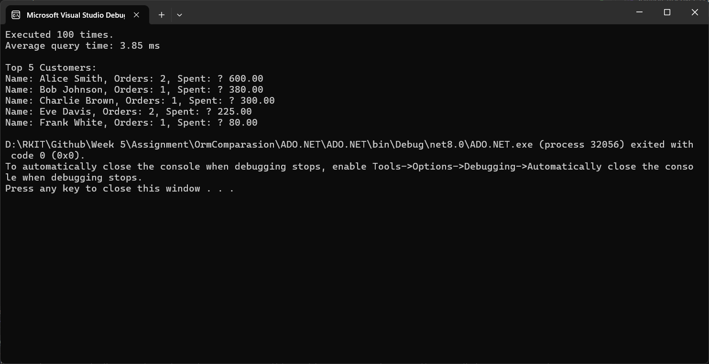
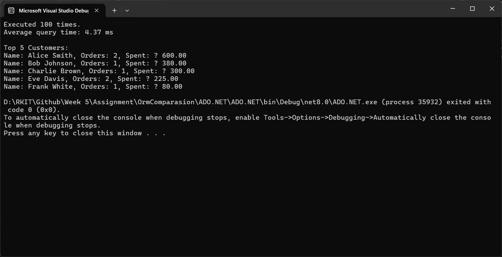
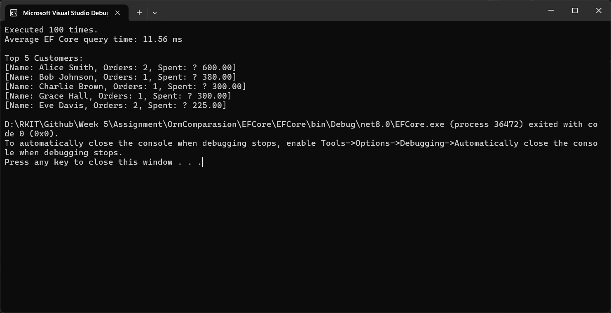

# ADO.NET vs. Dapper vs. Entity Framework Core: A Performance Comparison

This project tests three common ways to get data from a database in a .NET application: ADO.NET, Dapper, and Entity Framework Core (EF Core). We run the same complex query 100 times for each method and measure the average speed.

## Overview

When you build a .NET application, you have choices for how to talk to your database. Here’s a quick look at the ones we're testing:

| Method | Type | How it Works | Typical Speed |
| :--- | :--- | :--- | :--- |
| ADO.NET | Low-Level Library | You write the SQL and map data by hand. | Fastest |
| Dapper | Micro ORM | You write the SQL, but it maps data automatically. | Very Fast |
| EF Core | Full ORM | You write C# code (LINQ), and it creates the SQL for you. | Slower |

---

## The Concepts Explained

### 1. ADO.NET

This is the foundational way to access data in .NET. It gives you direct control over everything.

* You use basic tools like `SqlConnection`, `SqlCommand`, and `SqlDataReader`.
* You must manually write your SQL queries, open and close the database connection, and read the results row by row into your objects.
* **Best for:** Situations where you need the absolute best performance.

**Advantages:**

* It's the fastest method because there's no layer between your code and the database.
* You have complete control over the exact SQL query being run.

**Disadvantages:**

* It requires writing a lot of repetitive code (boilerplate).
* It's easy to make mistakes when mapping data from the reader to your objects.
* Can be difficult to maintain as your project grows.

### 2. Dapper

Dapper is a very popular, lightweight tool built by Stack Overflow. It's often called a "micro ORM" because it only does one thing really well: mapping query results to your C# objects.

* It works as a small add-on to ADO.NET.
* You still write your own SQL queries.
* It automatically handles the data mapping, saving you a lot of code.
* It's a great balance between performance and convenience.

**Advantages:**

* It's almost as fast as using raw ADO.NET.
* Requires much less code because the mapping is automatic.
* You still get the flexibility of writing your own SQL.

**Disadvantages:**

* It doesn't track changes to your objects (you have to write your own update/insert statements).
* You are still responsible for writing correct SQL.

### 3. Entity Framework Core (EF Core)

EF Core is a "full ORM" (Object-Relational Mapper) from Microsoft. It's a heavy-duty tool that lets you work with your database as if it were just a collection of C# objects.

* You write queries using C# (LINQ) instead of SQL.
* EF Core translates your C# code into SQL queries, runs them, and maps the results back to objects.
* It can also track changes to your objects and save them back to the database automatically.

**Advantages:**

* You don't have to write SQL (though you can if you want).
* It's great for productivity, especially in large, complex applications.
* Handles database creation and updates (migrations).

**Disadvantages:**

* It's noticeably slower because it's doing so much work behind the scenes.
* You have less control over the final SQL that gets generated.
* The learning curve can be steep.

---

## Benchmark Results

This table shows the average time it took to run the query 100 times.

| Technology | Average Execution Time (100 Iterations) |
| :--- | :--- |
| ADO.NET | 3.85 ms |
| Dapper | 4.37 ms |
| EF Core | 11.56 ms |

---

## Demo Screenshots

# ADO.NET vs. Dapper vs. Entity Framework Core: A Performance Comparison

This project tests three common ways to get data from a database in a .NET application: ADO.NET, Dapper, and Entity Framework Core (EF Core). We run the same complex query 100 times for each method and measure the average speed.

## Overview

When you build a .NET application, you have choices for how to talk to your database. Here’s a quick look at the ones we're testing:

| Method | Type | How it Works | Typical Speed |
| :--- | :--- | :--- | :--- |
| ADO.NET | Low-Level Library | You write the SQL and map data by hand. | Fastest |
| Dapper | Micro ORM | You write the SQL, but it maps data automatically. | Very Fast |
| EF Core | Full ORM | You write C# code (LINQ), and it creates the SQL for you. | Slower |

---

## The Concepts Explained

### 1. ADO.NET
This is the foundational way to access data in .NET. It gives you direct control over everything.

* You use basic tools like `SqlConnection`, `SqlCommand`, and `SqlDataReader`.
* You must manually write your SQL queries, open and close the database connection, and read the results row by row into your objects.
* **Best for:** Situations where you need the absolute best performance.

**Advantages:**
* It's the fastest method because there's no layer between your code and the database.
* You have complete control over the exact SQL query being run.

**Disadvantages:**
* It requires writing a lot of repetitive code (boilerplate).
* It's easy to make mistakes when mapping data from the reader to your objects.
* Can be difficult to maintain as your project grows.

### 2. Dapper
Dapper is a very popular, lightweight tool built by Stack Overflow. It's often called a "micro ORM" because it only does one thing really well: mapping query results to your C# objects.

* It works as a small add-on to ADO.NET.
* You still write your own SQL queries.
* It automatically handles the data mapping, saving you a lot of code.
* It's a great balance between performance and convenience.

**Advantages:**
* It's almost as fast as using raw ADO.NET.
* Requires much less code because the mapping is automatic.
* You still get the flexibility of writing your own SQL.

**Disadvantages:**
* It doesn't track changes to your objects (you have to write your own update/insert statements).
* You are still responsible for writing correct SQL.

### 3. Entity Framework Core (EF Core)
EF Core is a "full ORM" (Object-Relational Mapper) from Microsoft. It's a heavy-duty tool that lets you work with your database as if it were just a collection of C# objects.

* You write queries using C# (LINQ) instead of SQL.
* EF Core translates your C# code into SQL queries, runs them, and maps the results back to objects.
* It can also track changes to your objects and save them back to the database automatically.

**Advantages:**
* You don't have to write SQL (though you can if you want).
* It's great for productivity, especially in large, complex applications.
* Handles database creation and updates (migrations).

**Disadvantages:**
* It's noticeably slower because it's doing so much work behind the scenes.
* You have less control over the final SQL that gets generated.
* The learning curve can be steep.

---

## Benchmark Results

This table shows the average time it took to run the query 100 times.

| Technology | Average Execution Time (100 Iterations) |
| :--- | :--- |
| ADO.NET | 3.85 ms |
| Dapper | 4.37 ms |
| EF Core | 11.56 ms |

---

## Demo Screenshots

*(You can add your screenshots below)*

*Caption: ADO.NET execution time*

*Caption: Dapper execution time*

*Caption: EF Core execution time*

---

## What These Results Mean

* **ADO.NET** is the fastest because it's doing the least amount of extra work. It just runs your query.
* **Dapper** is very close in speed. The tiny bit of extra time it takes is for the automatic data mapping, which is highly optimized.
* **EF Core** is much slower in this test. This is because it has to:
    1.  Translate your C# (LINQ) query into a SQL query.
    2.  Prepare to track any changes to the data it fetches.
    3.  Manage a more complex data pipeline.

---

## When to Use Each One

Here's a simple guide for choosing:

| If your main priority is... | Use this... | Why? |
| :--- | :--- | :--- |
| Raw speed and control (e.g., reports, bulk data jobs). | ADO.NET | It's the fastest and gives you full control. |
| A good mix of speed and convenience (most common apps). | Dapper | It's fast and saves you from writing boring mapping code. |
| Productivity and complex business rules (large apps). | EF Core | It lets you work faster in C# and handles a lot for you. |
| Real-time apps where every millisecond counts. | ADO.NET or Dapper | Avoids the overhead of a full ORM. |
| Rapid development and you need database migrations. | EF Core | It's built for this and saves a lot of time. |

### ADO.NET Execution Time

### Dapper Execution Time

### EF Core Execution Time

---

## What These Results Mean

* **ADO.NET** is the fastest because it's doing the least amount of extra work. It just runs your query.
* **Dapper** is very close in speed. The tiny bit of extra time it takes is for the automatic data mapping, which is highly optimized.
* **EF Core** is much slower in this test. This is because it has to:
    1. Translate your C# (LINQ) query into a SQL query.
    2. Prepare to track any changes to the data it fetches.
    3. Manage a more complex data pipeline.

---

## When to Use Each One

Here's a simple guide for choosing:

| If your main priority is... | Use this... | Why? |
| :--- | :--- | :--- |
| Raw speed and control (e.g., reports, bulk data jobs). | ADO.NET | It's the fastest and gives you full control. |
| A good mix of speed and convenience (most common apps). | Dapper | It's fast and saves you from writing boring mapping code. |
| Productivity and complex business rules (large apps). | EF Core | It lets you work faster in C# and handles a lot for you. |
| Real-time apps where every millisecond counts. | ADO.NET or Dapper | Avoids the overhead of a full ORM. |
| Rapid development and you need database migrations. | EF Core | It's built for this and saves a lot of time. |
